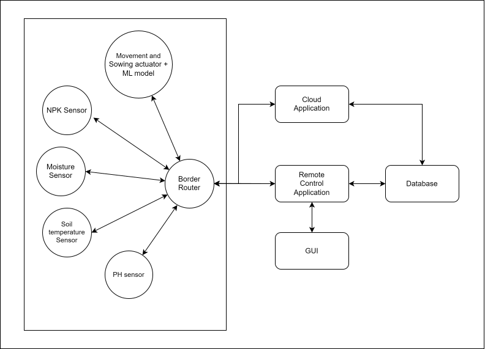

# SeedBot: Automated Sowing Device

SeedBot is a project developed at the University of Pisa for the Internet of Things course. It is an automated agricultural sowing system that utilizes a wireless sensor network to monitor soil conditions and control a seed distribution mechanism, aiming to improve efficiency and reduce manual labor. 
## Table of Contents

  - [Project Overview](project-overview)
  - [System Architecture](system-architecture)
  - [Machine Learning Model](machine-learning-model)
  - [Hardware and Software Requirements](hardware-and-software-requirements)
  - [License](license)

## Project Overview

In the context of smart industries, traditional agricultural methods are often labor-intensive and inefficient. SeedBot addresses these challenges by automating the sowing process, optimizing seed distribution based on real-time soil data, and minimizing the need for manual intervention. To determine the most suitable crop for a specific plot of land and to control seed distribution, the system uses real-time data from various sensors, including those for nitrogen, phosphorus, and potassium (NPK) levels, soil moisture, pH, and temperature. The position and results of the sowing are then sent to a central server for monitoring and analysis, allowing for corrections and optimizations. This reduces operational costs and production time, making farms more competitive.

## System Architecture

The system employs six nRF52840 devices organized into roles for sensors and actuators to ensure efficient communication and data collection.  The architecture includes:

  * **Border Router**: Acts as the central communication hub, managing data exchange between sensors, actuators, and external networks. 
  * **Sensors**:
      * **NPK Sensor**: Measures nitrogen, phosphorus, and potassium levels in the soil. 
      * **Moisture Sensor**: Monitors soil moisture. 
      * **pH Sensor**: Measures soil pH levels. 
      * **Temperature Sensor**: Collects soil temperature data. 
  * **Actuator**:
      * **Movement and Sowing Actuator**: Controls the robot's movement and seed distribution based on input from the machine learning model.
  * **Applications**:
      * **Cloud Application**: Handles storage and processing of sensor data in a central database. 
      * **Remote Control Application**: Provides a graphical user interface for remote control and real-time data monitoring. 

### System Scheme
#### With Machine Learning Model

## Machine Learning Model

The project utilizes a pre-trained machine learning model to determine the most suitable crop for a given plot of land. The initial dataset, sourced from Kaggle (link), contains information about various crops and their soil requirements. 

After evaluating several classifiers, including Logistic Regression, Random Forest, and SVM, a **Decision Tree** algorithm was chosen for its high accuracy and interpretability. The model was exported as a header file using the `emlearn` library and integrated into the SeedBot system to make real-time crop recommendations. 

## Hardware and Software Requirements

### Hardware

  * **nRF52840 Devices**: Six devices are used to implement the system, serving as sensors, an actuator, and a border router. 

### Software

  * **Embedded**: The code for the nRF52840 devices is written in **C**. 
  * **Backend & Cloud**:
      * The cloud and remote applications are written in **Python**. 
      * A **Flask** web server is used to create a RESTful API for user interaction. 
      * A **CoAP server** is used to manage communication between sensors and actuators. 
      * A **MySQL** database is used for data storage. 
  * **Monitoring**:
      * **Grafana** is used to visualize data and analytics from the database. 

## Code and Software

The code for SeedBot is written in C and Python, with data exchanged between devices in JSON format. The C code runs on the nRF52840 devices, while the cloud and remote applications are written in Python.  The code is available on GitHub at the following link.

  * **C Code**:
      * The **actuator** code controls movement and seed distribution, retrieves data from sensors, and applies the machine learning model to autonomously determine the seed type to sow.  
      * The **sensor** code simulates data readings and sends them to the border router. 
  * **Python Code**:
      * A **Flask** application provides a RESTful API for users to interact with the system, allowing them to initiate, pause, and stop the sowing process. 
      * A **CoAP server** manages communication between sensors and actuators, handling sensor registration, data retrieval, and actuator control. 

For more details, please refer to the project documentation and the [attached PDF](Documentation/documentation.pdf).

## Grafana Dashboard

Grafana is used to visualize the data and analytics stored in the database.  The dashboard provides real-time monitoring of various metrics, including soil moisture, temperature, pH, NPK levels, and the number of seeds sown.

## Authors

This project was developed by:

  * Francesco Nocella
  * Noemi Cherchi

## License

This project is licensed under the **Creative Commons Attribution-NonCommercial-ShareAlike 4.0 International License**. See the [LICENSE](http://creativecommons.org/licenses/by-nc-sa/4.0/) file for details.

This means the software is provided "as-is" and you are free to use, share, and adapt it for **non-commercial purposes**, as long as you provide appropriate attribution and distribute any derivative works under the same license.
